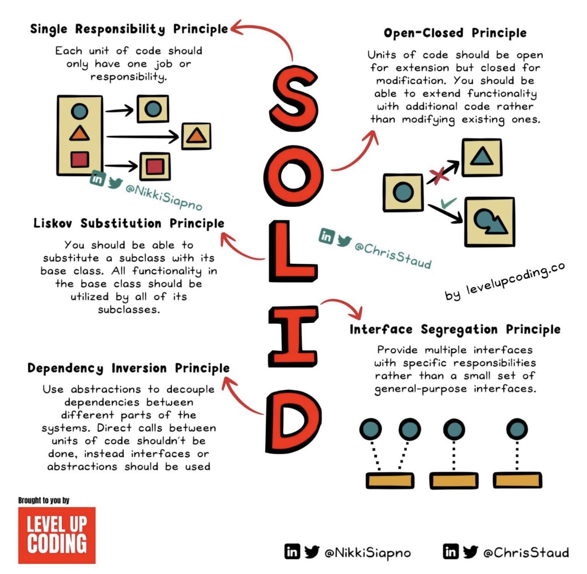

# Architecture Design Principles

## SOLID

[link](https://twitter.com/AmigosCode/status/1688466590000357376)

- O - Open/Closed Principle
- Software entities should be open for extension but closed for modification. Build systems that allow you to add new features without altering existing code.

- L - Liskov Substitution Principle
- Derived classes should be substitutable for their base classes without affecting the correctness of the program. Ensuring compatibility and consistency in your object-oriented design.

- I - Interface Segregation Principle
- Clients should not be forced to implement interfaces they don't use. Split large interfaces into smaller, focused ones, promoting flexibility and avoiding unnecessary dependencies.

- D - Dependency Inversion Principle
- High-level modules should not depend on low-level ones; both should depend on abstractions. Decouple components and promote better scalability and testability.

