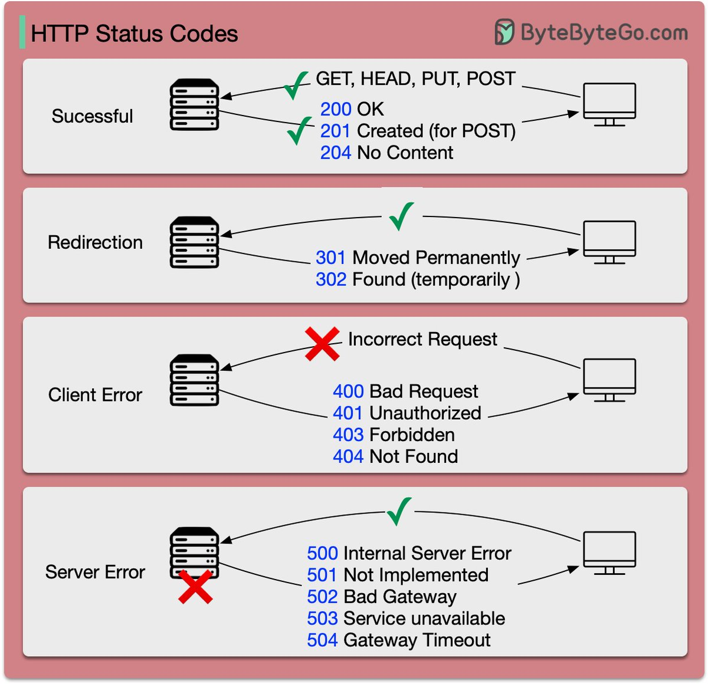
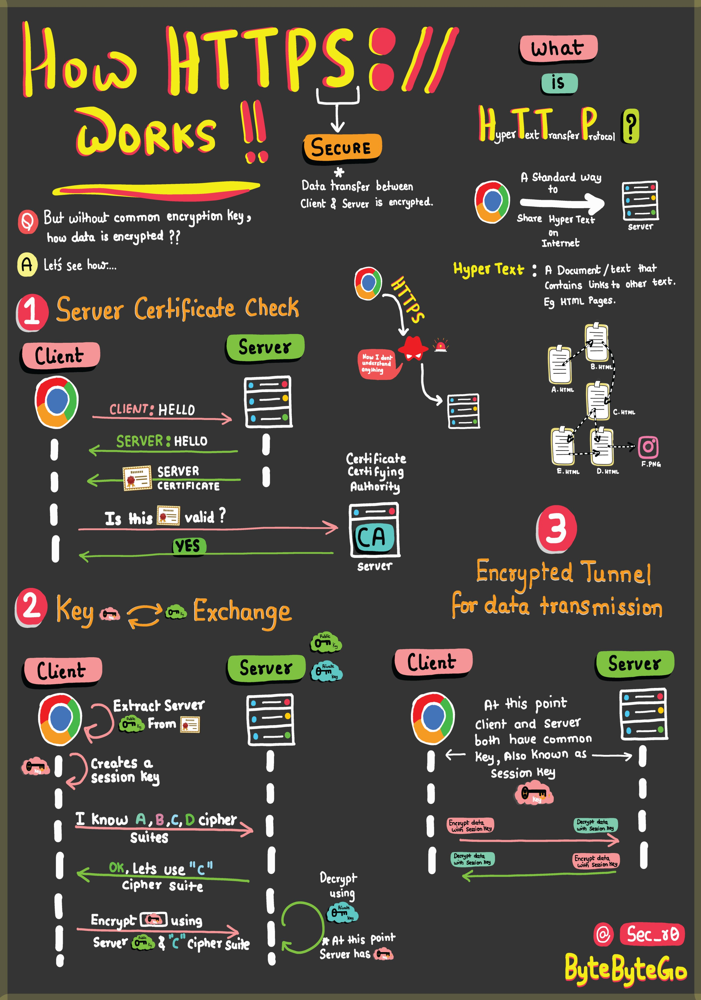

# HTTP

## Status Code

[link](https://twitter.com/alexxubyte/status/1712487706859905137)

The response codes for HTTP are divided into five categories:

- Informational (100-199)
- Success (200-299)
- Redirection (300-399)
- Client Error (400-499)
- Server Error (500-599)

These codes are defined in RFC 9110.

## HTTPS

[link](https://twitter.com/alexxubyte/status/1691834301791486022)

- HTTPS: Safeguards your data from eavesdroppers and breaches. Understand how encryption and digital certificates create an impregnable shield.

- SSL Handshake: Behind the Scenes — Witness the cryptographic protocols that establish a secure connection. Experience the intricate exchange of keys and negotiation.

- Secure Data Transmission: Navigating the Tunnel — Journey through the encrypted tunnel forged by HTTPS. Learn how your information travels while shielded from cyber threats.

- HTML's Role: Peek into HTML's role in structuring the web. Uncover how hyperlinks and content come together seamlessly. And why is it called HYPER TEXT.
